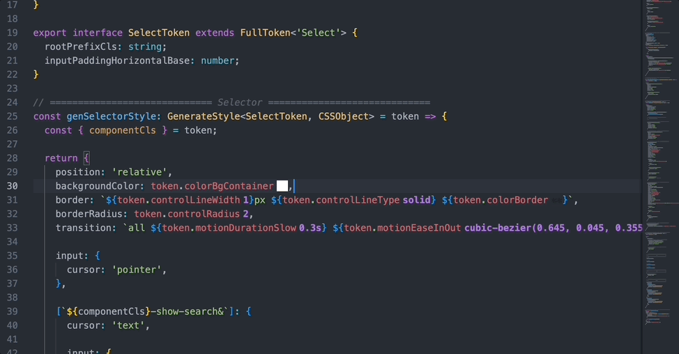
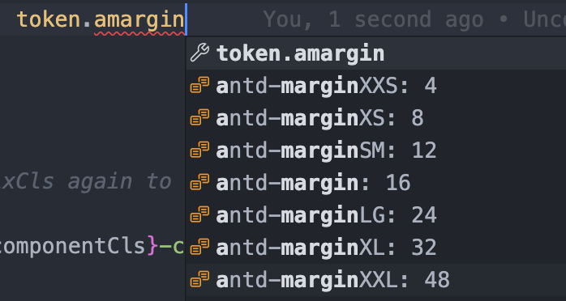

# antd design token

VSCode extension for antd v5 design token.

## Features

Provide the hover hint and editor decorations of antd v5 design token, include `color`, `value`:

Support completion for antd v5 design token value on typing. Note that for sorting, you can type an `a` before typing the token. For example, if you want to type `margin...`, you can type `amargin...`. Which will not affect the variable inserted after the enter keydown.

Sort by token value:

## Commands

You can use command: `antd-design-token:toggle` to active or inactive this extension.
